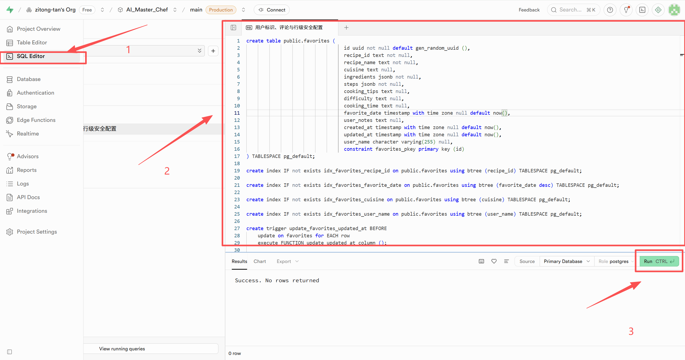

## 项目部署文档

### 1.按照.env.example文件，配置自己的大语言模型和图片模型的apikey和URL，建议选择豆包和质谱
### 2.配置完成后将 .env.example 文件名改为 .env 
### 3.在supabase上创建项目，并且将 .env.local 中的URL和KEY换成你自己的
### 4.将 .env.local.example 文件名改为 .env.local
### 5.在supabase中执行init.sql 文件，初始化数据库

### 6.运行 npm install
### 7.运行 npm run dev
